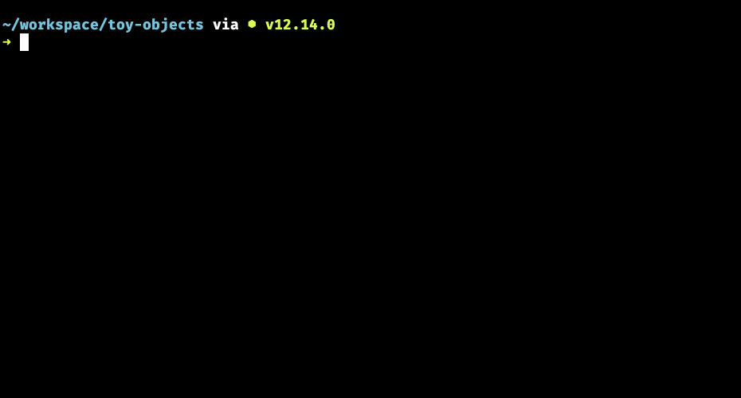
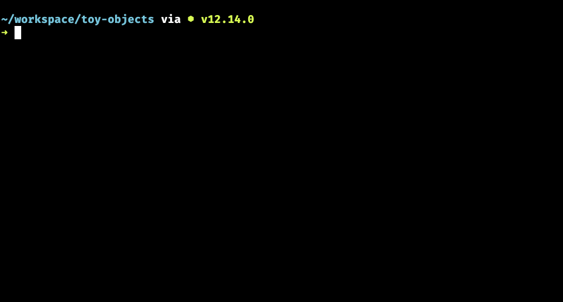

# Display Toy Properties

## Learning Objectives

* You should be able to demonstrate how to display a properties's value on an object.
* You should be able to explain the purpose of a `for..of` loop in JavaScript.
* You should be able to identify the variable that represents the array in a `for..of` loop.
* You should be able to identify the variable that represents each individual item in a `for..of` loop.

## Accessing Properties

To access a property of an object, you use a dot (`.`). You start with the variable name whose value is the object, type a dot, then type the name of the property you want to see. Let's use our phones as an example again.

```js
const iPhone = {
    maker: "Apple",
    operatingSystem: "iOS",
    price: 900,
    weight: 1.2
}
```

If you want to see **just the price** of the iPhone, and nothing else, here's how you would display it with `console.log()`.

```js
const iPhone = {
    name: "iPhone",
    maker: "Apple",
    operatingSystem: "iOS",
    price: 900,
    weight: 1.2
}

console.log(iPhone.price)
```

There's the pattern. `iPhone` is the variable whose value is the entire object, followed by a dot, then the name of the property to display.

## Display All Prices with Iteration

You want to see the price of all phones that are stored in an array, like the one from the previous chapter.

```js
const phones = [
    {
        id: 1,
        name: "iPhone",
        maker: "Apple, Inc.",
        operatingSystem: "iOS",
        price: 900,
        weight: 1.2
    },
    {
        id: 2,
        name: "Galaxy",
        maker: "Samsung",
        operatingSystem: "Android",
        price: 600,
        weight: 1.4
    }
]
```

Since those objects in the array aren't assigned to their own variables, then you have to iterate the array with a `for..of` loop. Here's how you do it.

```js
for (const phone of phones) {
    console.log(phone)
}
```

What will be displayed in the console? The entire array? No, it won't. This `for` loop iterates the array, which is a fancy word for "access the first item in the array, then the next, then the next until there are no more items to access".

In this loop, the individual objects will now be stored in the variable `phone`. Each time. Here you see the power of variables. That's the definition of variable. Something whose value _varies_.

In this case, the value of the `phone` value varies as the `for` loop moves through the array one item at a time.


Notice that there are no square brackets `[]` around the output. Each object is displayed, one at a time.

Now you can use the dot notation to just display the prices instead of the entire object.

```js
for (const phone of phones) {
    console.log(phone.price)
}
```




You can even be fancy and use string interpolation to put a dollar sign in front of the prices when they are output.

```js
for (const phone of phones) {
    console.log(`Price is $${phone.price}`)
}
```

