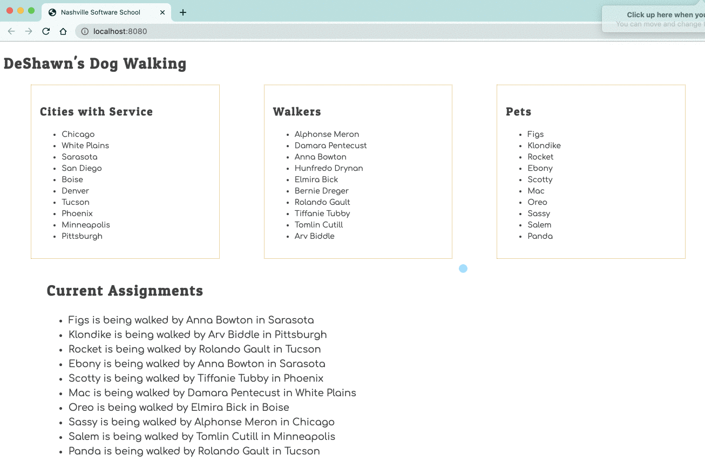
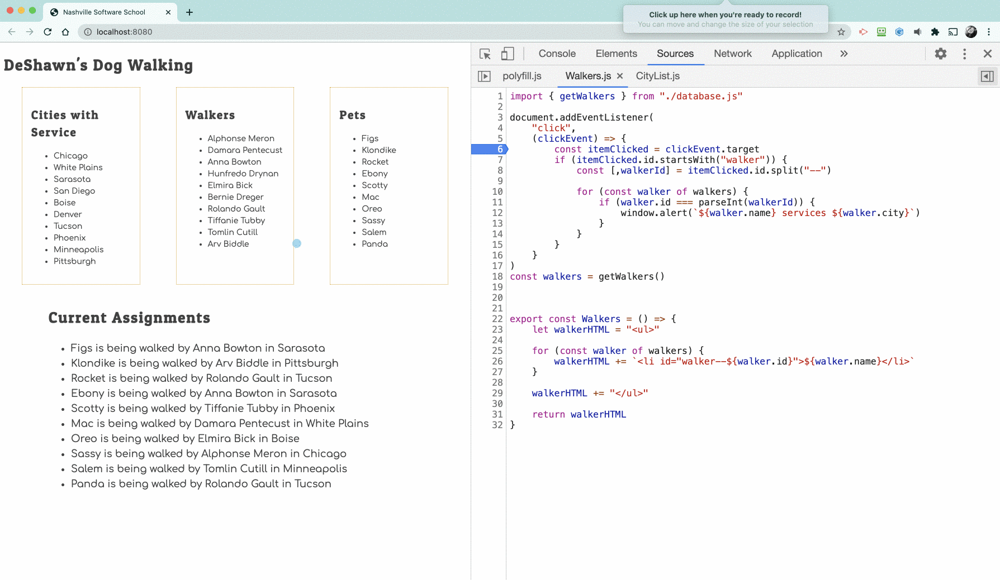

# Chpt 4: Show Walker Service Area
#data #functions #events

Time for your first event listener. You are going to use your debugger to step through the code to see how it all works.

Add the following code after the import statement in the Walkers module.

> #### `workspace/dog-walking/scripts/Walkers.js`

```js
document.addEventListener(
    "click",
    (clickEvent) => {
        const itemClicked = clickEvent.target
        if (itemClicked.id.startsWith("walker")) {
            const [,walkerId] = itemClicked.id.split("--")

            for (const walker of walkers) {
                if (walker.id === parseInt(walkerId)) {
                    window.alert(`${walker.name} services ${walker.city}`)
                }
            }
        }
    }
)
```

Inside the `for..of` loop in the existing code, update the line of code to be the following code.

```js
walkerHTML += `<li id="walker--${walker.id}">${walker.name}</li>`
```

Refresh your browser to load the new code.

Then click on some of the walkers. You should see the name of the city the walker works in appear in an alert box.



## Step Through the Code

Open the `Walker.js` file in your developer tools.

1. Open your dev tools.
1. Click on the Sources tab.
1. Use the keyboard shortcut of `ctrl+p` on Windows or `cmd+p` on Mac.
1. Type in the name of the file and select it.
1. Put a breakpoint on the following line of code.
    ```js
    const itemClicked = clickEvent.target
    ```
1. Click on a walker.
1. Use the step over icon to run each line of code and examine what the values of the variables are.


