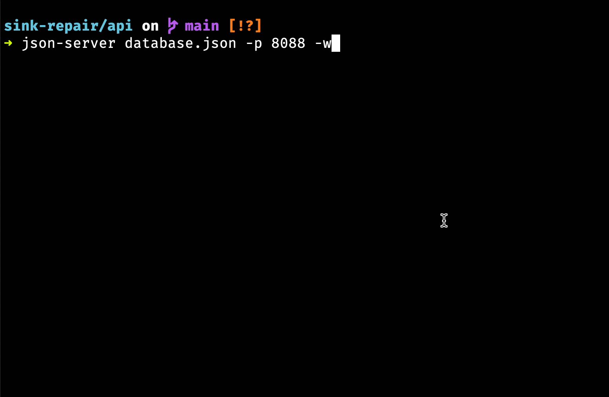

# Chpt 4: Listing Past Requests
#fetch #GET

Before you get to saving new requests, you should list any previous requests. You are going to use a `fetch()` to get all existing requests and then list them in the UI.

Feel free to go back to chapter 1 and review the video about using `fetch()`.

## Manually Create a Request

Put the following object in the "requests" array in your `database.json` file.

```json
{
    "id": 1,
    "description": "Aut sint voluptatem fugit eius quas molestiae modi.",
    "address": "34445 Bianka Ports",
    "budget": 400,
    "neededBy": "2021-08-27"
}
```

Feel free to add more if you want.

Then open a new terminal and navigate to the `sink-repair/api` directory. Once there run the following command.

```sh
json-server database.json -p 8088 -w
```

You should see the following output. If you don't, see an instructor.



## Application State

You will need to store that external data in your application state when you fetch it. Create a property named `requests` in your application state object. Its initial value must be an empty array.

## HTTP GET Request with Fetch

Place the following variable and function in your `dataAccess.js` module.

```js
const API = "http://localhost:8088"

export const fetchRequests = () => {
    return fetch(`${API}/requests`)
        .then(response => response.json())
        .then(
            (serviceRequests) => {
                // Store the external state in application state
                applicationState.requests = serviceRequests
            }
        )
}
```

## Export Requests State

Define and export a function named `getRequests` that returns a copy of the requests state. Go back to a previous project and look at the functions that return copies of arrays in the `database` module if you've forgotten the syntax.

## Fetch State Before Displaying

You need to fetch the data from the API and store it in application state before you can convert the data structures to HTML representations. The syntax here is very confusing for a beginner, and your instruction team will explain the logic when they do a live coding review.

> #### `sink-repair/src/scripts/main.js`

```js
import { fetchRequests } from "./dataAccess.js"
import { SinkRepair } from "./SinkRepair.js"


const mainContainer = document.querySelector("#container")

const render = () => {
    fetchRequests().then(
        () => {
            mainContainer.innerHTML = SinkRepair()
        }
    )
}

render()
```


## Core Skills: Critical and Creative Thinking

Here is some starter code.

> #### `sink-repair/src/scripts/SinkRepair.js`

```js
import { Requests } from "./Requests.js"


export const SinkRepair = () => {
    return `
        <h1>Maude and Merle's Sink Repair</h1>
        <section class="serviceForm">
        </section>

        <section class="serviceRequests">
            <h2>Service Requests</h2>
            ${Requests()}
        </section>
    `
}
```

In the following code, you will need to define the function that will be passed to the `map()` method.

The function you write will convert each service request object into HTML representations. Since it is wrapped with a `<ul>` element, make each one an `<li>` element showing only the description of the request to start.

For example, if you write a function named `convertRequestToListElement`, then you would update the code below to `requests.map(convertRequestToListElement)`.

> #### `sink-repair/src/scripts/Requests.js`


```js
import { getRequests } from "./dataAccess.js"

export const Requests = () => {
    const requests = getRequests()

    let html = `
        <ul>
            ${
                requests.map()
            }
        </ul>
    `

    return html
}
```

## Core Skill: Collaboration

Work with your peers to get this built out. If you still aren't able to get the requests to list after ~20-30 minutes of attempts, contact an instructor to walk through it.
