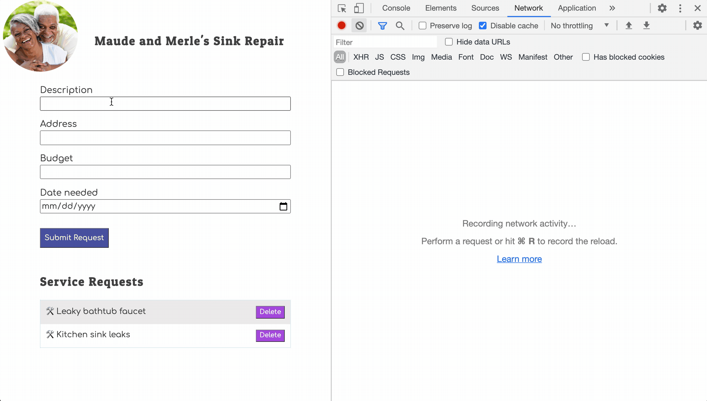

# Chpt 8: Denying Service Requests



## Delete with Fetch

When you use the DELETE method on an HTTP request, you must identify a single resource.

|                   |                                                                                                             |
| :---------------: | :---------------------------------------------------------------------------------------------------------- |
| <h1>&#x2757;</h1> | _You can't delete an entire collection with a single HTTP request. Else the Universe will implode on you!!_ |

Therefore, the function whose responsiblity it is to initiate the fetch request for DELETE must have the primary key sent to it as an argument.

> **`sink-repair/src/scripts/dataAccess.js`**

```js
export const deleteRequest = (id) => {
    return fetch(`${API}/requests/${id}`, { method: "DELETE" })
        .then(
            () => {
                mainContainer.dispatchEvent(new CustomEvent("stateChanged"))
            }
        )
}
```

## Delete Button

Now that you have a function that can send a DELETE request to the API, you can add a button for the user to click and initiate that process. Add the button element right next to the text of each request.

> **`sink-repair/src/scripts/Requests.js`**

```js
return `
    <li>
        ${request.description}
        <button class="request__delete"
                id="request--${request.id}">
            Delete
        </button>
    </li>
`
```

## Delete Click Listener

Now add an event listener to the main container. When the user clicks on any of the delete buttons, invoke the `deleteRequest()` function you just made above. Make sure you pass the `id` of the service request to the `deleteRequest()` function as an argument.

> **`sink-repair/src/scripts/Requests.js`**

```js
const mainContainer = document.querySelector("#container")

mainContainer.addEventListener("click", click => {
    if (click.target.id.startsWith("request--")) {
        const [,requestId] = click.target.id.split("--")
        deleteRequest(parseInt(requestId))
    }
})
```
