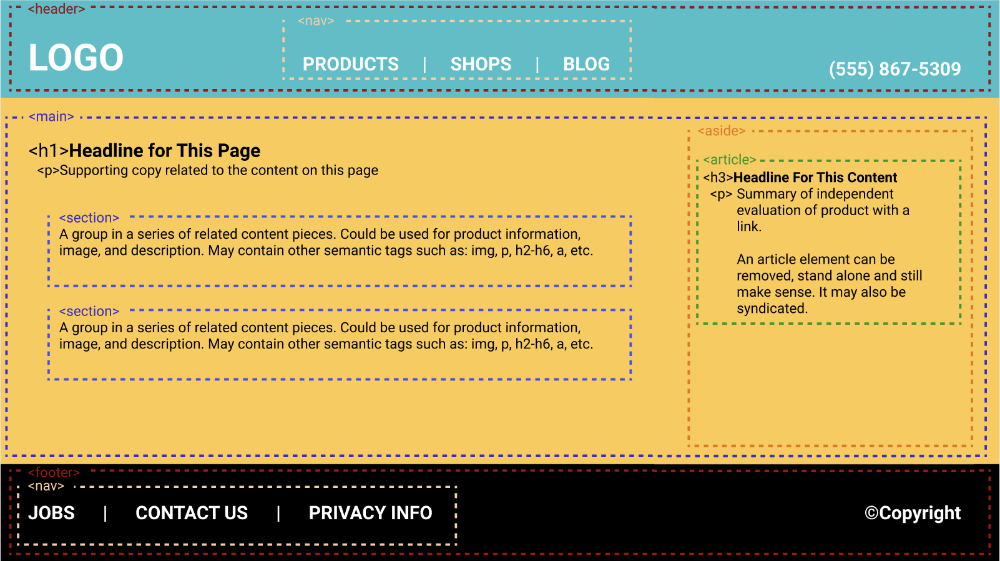
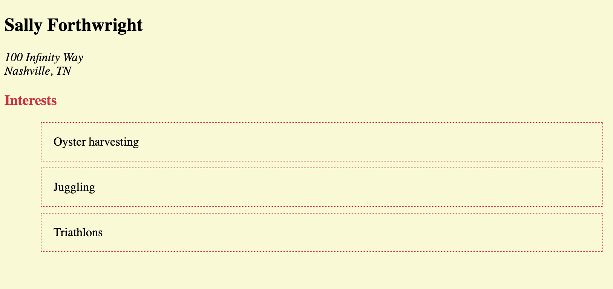
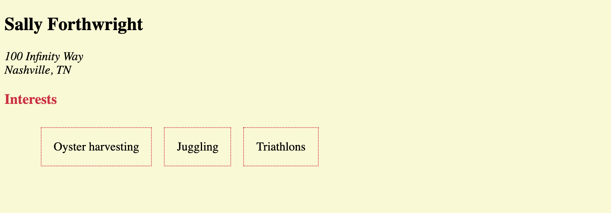
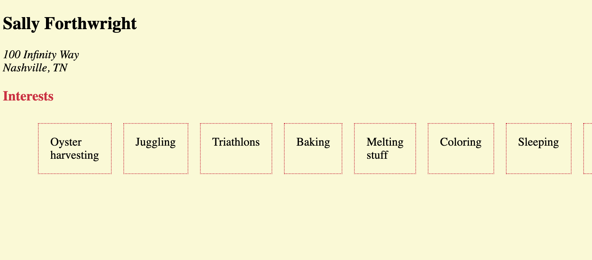
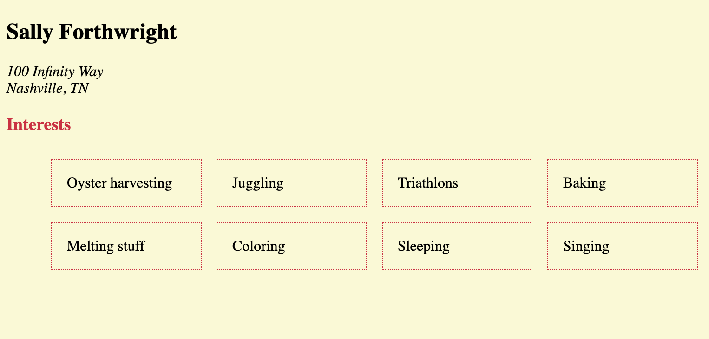
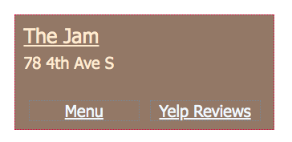
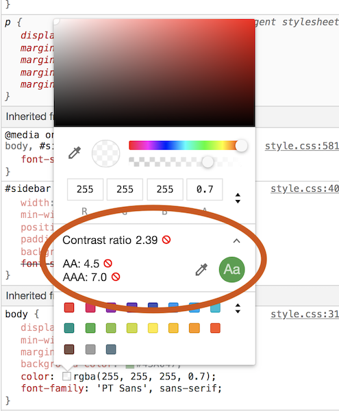

# HTML Layout and Components

## Why Are You Learning This?

Thinking about apps and web pages as a collection of independent components is the foundation of modern web applications. Consider Snapchat, Instagram, Twitter, Facebook, Etsy, or Pinterest. All of these applications are written by teams of software developers who define individual components that are used throughout the application. They then write each component separately and compose them in interesting ways to make them work together.

## Vocabulary To Learn
* HTML semantic elements
* HTML block and inline elements
* CSS
* Flexbox

## What are Semantic Elements?
A semantic element clearly describes its meaning to both the browser and the developer.

* Examples of **non-semantic** elements: `<div>` and `<span>` - Tells nothing about its content.
* Examples of **semantic** elements: `<form>`, `<h1>`, and `<article>` - Clearly defines its content.
* [W3 Schools Semantic Elements](https://www.w3schools.com/html/html5_semantic_elements.asp)
* [HTML Semantic Tag Cheatsheet](https://learn-the-web.algonquindesign.ca/topics/html-semantics-cheat-sheet/)

## Visual Review of Semantic Elements

What is a component and how do HTML elements apply to the concept? Look at the image below to see an overview of semantic HTML elements and how they are used together.



## Block and Inline Elements
Every HTML element has a default display value, depending on what type of element it is. There are two display values: **block** and **inline**.

Block Element
* A block-level element always starts on a new line.
* A block-level element always takes up the full width available (stretches out to the left and right as far as it can).
* A block level element has a top and a bottom margin, whereas an inline element does not.
* Examples: `<h1>`, `<header>`, `<p>`
* [MDN Block Elements](https://developer.mozilla.org/en-US/docs/Web/HTML/Block-level_elements)

Inline Element
* An inline element does not start on a new line.
* An inline element only takes up as much width as necessary.
* Examples: ``, `<span>`, `<strong>`
* [MDN Inline Elements](https://developer.mozilla.org/en-US/docs/Web/HTML/Inline_elements)

**The default display for all elements can be changed through styling.**

## CSS Naming Conventions

Styling components can be handled through naming your classes according to the component name. One popular convention is the [BEM method](http://getbem.com/introduction/).

If you were creating an HTML component that represents you, here's an example of how the code would look using HTML semantic elements and BEM class names.

```html
<main>
    <!-- Parent biography component -->
    <div class="bio">

        <!-- Child biography component -->
        <section class="bio__name">
            <h2>Sally Forthwright</h2>
        </section>

        <!-- Child biography component -->
        <address class="bio__address">
				100 Infinity Way<br>
				Nashville, TN
		</address>

        <!-- Child biography component -->
        <section class="bio__interests">
			<h3>Interests</h3>
			<ul>
				<li class="interest">Oyster harvesting</li>
				<li class="interest">Juggling
				<li class="interest">Triathlons</li>
			</ul>
		</section>

    </div>
</main>
```

Each component can be styled individually with a clear, concise name that also provides some context when looking at the CSS file. Before writing custom styles, notice the browser applies default styling.


Now you can target specific elements and apply custom styles.

```css
.bio__interests ul{
	list-style-type: none;
}

.bio__interests .interest {
    border: 1px dotted crimson;
    padding: 1em;
    margin: 0.5em;
}

.bio__interests h3 {
	color: crimson;
}
```



## Grid Layout with Flexbox

Flexbox is a tool that you can use in CSS to apply layout to the HTML. One of the most common layout type is a grid, and it's straightforward to do with Flexbox.

There are many Flexbox properties and CSS-Tricks provides a great guide for use: [A Complete Guide To Flexbox](https://css-tricks.com/snippets/css/a-guide-to-flexbox/)

With Sally's Interests, you want them to be all in the same row (instead of stacking). The first thing you need to do is apply a style to the component in which all of those interests are contained. In your case, it's the `<section class="bio__interests">` component.

```css
.bio__interests ul{
	list-style-type: none;
	display: flex; /* Display the child items in a Flex layout */
}
```



The `display: flex` property on a parent element creates a row and puts all of the child elements in it. However, what if you add more interests for Sally?


```html
<li class="interest">
    Baking
</li>
<li class="interest">
    Melting stuff
</li>
<li class="interest">
    Coloring
</li>
<li class="interest">
    Sleeping
</li>
<li class="interest">
    Singing
</li>
```



The default behavior is to put **all** child elements into a single row and ultimately you will run out of room. You need to tell the browser to automatically figure out how many can fit in a row, and when there's no more room, create a new row. This is applied to the parent element.

```css
.bio__interests ul{
	list-style-type: none;
	display: flex;
	flex-wrap: wrap;  /* Let the rows wrap if there are too many */
}
```


One guiding principle of user experience is to line things up. We can accomplish this with the child property `flex`.

```css
.bio__interests .interest {
    border: 1px dotted crimson;
    padding: 1em;
    margin: 0.5em;
	flex: 1 1 16%;
}
```



Flex Properties
* flex-grow: How much of the positive free space does this item get?
* flex-shrink: How much negative free space can be removed from this item?
* flex-basis: What is the size of the item before growing and shrinking happens?


## Additional References

1. [CSS Tricks - Flexbox](https://css-tricks.com/snippets/css/a-guide-to-flexbox/)
1. [CSS Flexible Box Layout MDN](https://developer.mozilla.org/en-US/docs/Web/CSS/CSS_Flexible_Box_Layout)
1. [CSS Tricks - BEM](https://css-tricks.com/bem-101/)
1. [Introduction to BEM - A front-end methodology](https://www.youtube.com/watch?v=IO-4Z32O--c)

## Practice: Flexbox Froggie
[Flexbox Froggie](http://flexboxfroggy.com/) - online game with 24 challenges.

## Practice: Coffee Houses of Nashville
1. Use the terminal to create a directory (within workspace) for coffee-houses.
1. Use the terminal to create an `index.html`.
1. Use the terminal to create a styles directory with a `main.css` file.
1. Use the terminal to open your project in VS Code and begin the exercise.

#### Part 1
> The learning objective for this practice exercise is to use `display:flex` on a list component, and then add additional CSS properties to achieve a desired layout.

```html
<header class="pageHeader">
	<h1>Coffee Houses of Nashville</h1>
</header>

<main>
	<section class="list">
		<article class="shop">The Jam</article>
		<article class="shop">The Well</article>
		<article class="shop">Red Bicycle</article>
		<article class="shop">Crema</article>
		<article class="shop">Frothy Monkey</article>
		<article class="shop">8th &amp; Roast</article>
		<article class="shop">Bongo Java</article>
		<article class="shop">Flatrock</article>
		<article class="shop">Fido</article>
		<article class="shop">Steadfast Coffee</article>
		<article class="shop">Dose Coffee</article>
		<article class="shop">Sam &amp; Zoes</article>
		<article class="shop">Slow Hand Coffee</article>
		<article class="shop">The Horn</article>
	</section>
</main>
```

Use the above HTML and Flexbox to achieve the following layout. You don't need to add the border to each coffee house component, but you can if you like. It's been added in this example to highlight the alignment and spacing you're shooting for.


* Once you complete this part, create a repo on GitHub and push your project.

#### Part 2 - Creating visual hierarchies

1. Add a tagline, address, phone number, website link, and menu link to each coffee house (you may use mock/fake data).
1. Each coffee house component should utilize Flexbox for the layout.
1. Use semantic HTML with CSS to style each coffee house component with the goal of easy scan-ability by the user. At a minimum, you will emphasize the name of each shop and make the links clearly clickable.

Example layout for one shop (don't forget the additional information)



Once you complete this part, push your project to GitHub.

## Practice: Congressional Representative
#### Part 1
You're going to create an HTML component to represent a political candidate. Specifically, the representative of your Congressional district. Visit the GovTrack site link below, enter in your home address, and you'll find basic information about your representative.

[GovTrack - Congressional District Map](https://www.govtrack.us/congress/members/map)

##### Setup
1. Use the terminal to create a directory (within workspace) for congressional-representative.
1. Use the terminal to create an `index.html`.
1. Use the terminal to create a styles directory with a `main.css` file.
1. Use the terminal to open your project in VS Code and begin the exercise.

##### Exercise
1. Read through the requirements and sketch out a wireframe for the page.
1. In your HTML, create an `main` element that will serve as your main representative component.
1. In this component, create a sub-component for basic information using the `section` element. Within this section create elements for the representative's image, name, district info, and political affiliation.
1. Beneath the basic information, you will create a sub-component, using a `section` element, to list any committees the candidate is serving on.
1. The last component will hold links to any legislation that your representative has enacted.

Make sure you use good BEM-style class names for each element in your components. Put a comment above each component explaining what it is.

Once you complete this part, push your project to GitHub.


#### Part 2
> User Interface: Web pages should be designed in such a way that they are easy to scan.

How to improve scan-ability?
* Create visual hierarchies: What is the most important information on the page? What is supportive information? Can you use bulleted lists?
* Use universally accepted conventions: These may include placement of logo/tagline, buttons/links colors, or positioning of social networking options, etc.
* Break the page into clearly defined sections.
* Make it obvious what’s clickable.

1. Review the page you just created. Based on the items above, identify some opportunities to improve the user experience. Refactor your page to improve the usability. You may add semantic tags, content, and styles.

1. Text with background color/image - ensure the copy (text color) has good contrast and is legible. Included with Chrome Dev Tools is an Audit panel. Run an Audit on the page and determine if the text color has appropriate contrast. More information: https://developer.chrome.com/docs/devtools/accessibility/reference/

Once you complete this part, push your project to GitHub.


## Coffee Houses Text and Background Colors
**This is an optional challenge**

Review your background color/image and ensure the copy (text color) has good contrast and is legible. Use the Chrome Dev Tools to inspect your color choices. Research the AA and AAA rating and make adjustments to your project.


